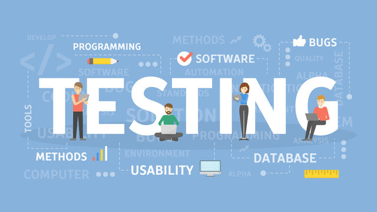

# THIS SITE IS STILL UNDER CONSTRUCTION :mage_woman:

- 👋 Hi, I’m @motalbot85
- 👀 I’m interested in learning more about QA, travel, games, music
- 🌱 I’m currently learning Javascript, QA Automation tools, UI/UX design
- 💞️ I’m looking to collaborate on any QA Automation project
- 📫 How to reach me - momaceda85@gmail.com
- 😄 Pronouns: She/her/hers
- ⚡ Fun fact: Bolivian living in the USA

# 🌐 Socials:
  

# 🔧 Tools:
## 📅 Project Management and 🪲 Bug Tracking:
      

## 📝 Documentation
  

## 🔁 API Tools
 

<!---
motalbot85/motalbot85 is a ✨ special ✨ repository because its `README.md` (this file) appears on your GitHub profile.
You can click the Preview link to take a look at your changes.
--->
